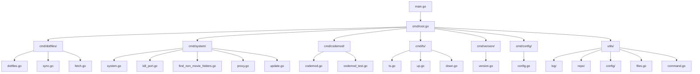

# eng CLI

```shell
                                          __ __
                                         |  \  \
  ______  _______   ______        _______| ▓▓\▓▓
 /      \|       \ /      \      /       \ ▓▓  \
|  ▓▓▓▓▓▓\ ▓▓▓▓▓▓▓\  ▓▓▓▓▓▓\    |  ▓▓▓▓▓▓▓ ▓▓ ▓▓
| ▓▓    ▓▓ ▓▓  | ▓▓ ▓▓  | ▓▓    | ▓▓     | ▓▓ ▓▓
| ▓▓▓▓▓▓▓▓ ▓▓  | ▓▓ ▓▓__| ▓▓    | ▓▓_____| ▓▓ ▓▓
 \▓▓     \ ▓▓  | ▓▓\▓▓    ▓▓     \▓▓     \ ▓▓ ▓▓
  \▓▓▓▓▓▓▓\▓▓   \▓▓_\▓▓▓▓▓▓▓      \▓▓▓▓▓▓▓\▓▓\▓▓
                  |  \__| ▓▓
                   \▓▓    ▓▓
                    \▓▓▓▓▓▓
```

[](https://github.com/eng618/eng/actions/workflows/go.yml)
[](https://goreportcard.com/report/github.com/eng618/eng)


A modern, modular CLI tool for developer automation, dotfiles management, system utilities, and project codemods. Built in Go, designed for extensibility and productivity.

---

## Features

- **Modular CLI**: Each command is a self-contained module (dotfiles, system, codemod, ts, version, config)
- **Dotfiles Management**: Manage dotfiles via a bare git repo, with sync/fetch helpers
- **System Utilities**: MacOS/Linux helpers (kill port, find folders, proxy, update)
- **Codemod Automation**: Project codemods (e.g., lint setup for JS/TS projects)
- **TypeScript Helpers**: Up/down migration helpers for TypeScript projects
- **Config Management**: Centralized config via Viper
- **Versioning**: Shows build info, checks for updates, Homebrew auto-update
- **Taskfile-based Dev Workflow**: Build, test, lint, release, changelog automation
- **CI/CD**: GitHub Actions for lint, test, release, changelog

---

## Architecture



---

## Installation

### Homebrew (Recommended)

```sh
brew tap eng618/eng
brew install eng
```

### Go Install

```sh
go install github.com/eng618/eng@latest
```

### From Source

```sh
git clone https://github.com/eng618/eng.git
cd eng
go install .
```

---

## Usage

```sh
eng [command] [flags]
```

### Common Commands

- `eng dotfiles` — Manage dotfiles (sync, fetch, info)
- `eng system` — System utilities (kill-port, find-non-movie-folders, update, proxy)
- `eng codemod` — Project codemods (e.g., lint-setup)
- `eng ts` — TypeScript helpers (up, down)
- `eng version` — Show version, check for updates
- `eng config` — Show or edit config

---

## Command Reference

### Dotfiles

- `eng dotfiles --info` — Show current dotfiles config
- `eng dotfiles sync` — Sync dotfiles repo
- `eng dotfiles fetch` — Fetch latest dotfiles

### System

- `eng system kill-port <port>` — Kill process on a port
- `eng system find-non-movie-folders [--dry-run]` — Find/delete non-movie folders
- `eng system update` — Update system packages
- `eng system proxy` — Manage proxy settings

### Codemod

- `eng codemod lint-setup` — Setup lint/format (eslint, prettier, husky, lint-staged) in JS/TS projects

### TypeScript

- `eng ts up` — Run up migration
- `eng ts down` — Run down migration

### Version

- `eng version` — Show version, build info, check for updates
- `eng version --update` — Auto-update via Homebrew (if installed that way)

### Config

- `eng config` — Show config
- `eng config edit` — Edit config

---

## Development Workflow

- **Build**: `task build` or `go build`
- **Install**: `task install` or `go install`
- **Lint**: `task lint` (uses golangci-lint)
- **Test**: `task test` (with coverage)
- **Validate**: `task validate` (lint + test)
- **Changelog**: `task changelog` (uses git-chglog)
- **Release**: `task release` (goreleaser + changelog)
- **Module Management**: `task tidy`, `task deps-upgrade`, etc.

See `Taskfile.yaml` for all tasks.

---

## Release & CI/CD

- **Changelog**: Automated with [git-chglog](https://github.com/git-chglog/git-chglog)
- **Release**: [goreleaser](https://goreleaser.com/) for multi-platform builds
- **CI**: GitHub Actions (`.github/workflows/go.yml`) runs lint, test, changelog, and release on tag push
- **Changelog in CI**: `task changelog-ci` runs on tag push

---

## Contributing

- Follow idiomatic Go style (see `.github/copilot-instructions.md`)
- Use Go modules (`go mod tidy`)
- Lint with `golangci-lint`
- Write and update tests for all code (`go test -cover`)
- Document code with GoDoc comments
- Keep this README up to date

---

## License

MIT License © 2023–2025 Eric N. Garcia

---

## Links

- [GitHub Repo](https://github.com/eng618/eng)
- [Releases](https://github.com/eng618/eng/releases)
- [Changelog](CHANGELOG.md)
- [Taskfile](Taskfile.yaml)
