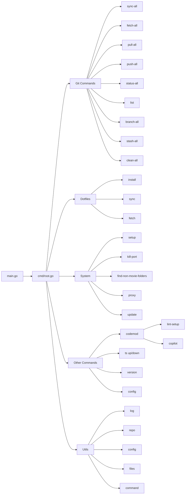

# eng CLI

```shell
                                          __ __
                                         |  \  \
  ______  _______   ______        _______| ▓▓\▓▓
 /      \|       \ /      \      /       \ ▓▓  \
|  ▓▓▓▓▓▓\ ▓▓▓▓▓▓▓\  ▓▓▓▓▓▓\    |  ▓▓▓▓▓▓▓ ▓▓ ▓▓
| ▓▓    ▓▓ ▓▓  | ▓▓ ▓▓  | ▓▓    | ▓▓     | ▓▓ ▓▓
| ▓▓▓▓▓▓▓▓ ▓▓  | ▓▓ ▓▓__| ▓▓    | ▓▓_____| ▓▓ ▓▓
 \▓▓     \ ▓▓  | ▓▓\▓▓    ▓▓     \▓▓     \ ▓▓ ▓▓
  \▓▓▓▓▓▓▓\▓▓   \▓▓_\▓▓▓▓▓▓▓      \▓▓▓▓▓▓▓\▓▓\▓▓
                  |  \__| ▓▓
                   \▓▓    ▓▓
                    \▓▓▓▓▓▓
```

[](https://github.com/eng618/eng/actions/workflows/go.yml)
[](https://goreportcard.com/report/github.com/eng618/eng)
[](https://app.codacy.com/gh/ENG618/eng/dashboard?utm_source=gh&utm_medium=referral&utm_content=&utm_campaign=Badge_grade)


A modern, modular CLI tool for developer automation, dotfiles management, system utilities, and project codemods. Built in Go, designed for extensibility and productivity.

---

## Features

- **Modular CLI**: Each command is a self-contained module (git, dotfiles, system, codemod, ts, version, config)
- **Git Repository Management**: Bulk operations across multiple git repositories with intelligent branch detection
- **Dotfiles Management**: Manage dotfiles via a bare git repo, with sync/fetch helpers
- **System Utilities**: MacOS/Linux helpers (kill port, find folders, proxy, update)
- **Codemod Automation**: Project codemods (e.g., lint setup for JS/TS projects)
- **TypeScript Helpers**: Up/down migration helpers for TypeScript projects
- **Config Management**: Centralized config via Viper
- **Versioning**: Shows build info, checks for updates, Homebrew auto-update
- **Taskfile-based Dev Workflow**: Build, test, lint, release, changelog automation
- **CI/CD**: GitHub Actions for lint, test, release, changelog

---

## Architecture



## Installation

### Homebrew (Recommended)

```sh
brew tap eng618/eng
brew install eng
```

### Go Install

```sh
go install github.com/eng618/eng@latest
```

### From Source

```sh
git clone https://github.com/eng618/eng.git
cd eng
go install .
```

---

## Usage

```sh
eng [command] [flags]
```

### Common Commands

- `eng git` — Git repository management across multiple repos
- `eng dotfiles` — Manage dotfiles (sync, fetch, info)
- `eng system` — System utilities (kill-port, find-non-movie-folders, update, proxy)
- `eng codemod` — Project codemods (e.g., lint-setup)
- `eng ts` — TypeScript helpers (up, down)
- `eng version` — Show version, check for updates
- `eng config` — Show or edit config

---

## Command Reference

### Git Repository Management

Manage multiple git repositories in your development folder with a comprehensive set of commands. All commands support the `--current` flag to operate on the current directory instead of the configured development path.

#### Setup

```sh
# Configure your development folder path
eng config git-dev-path /path/to/your/dev/folder
```

#### Repository Operations

- `eng git sync-all [--current] [--dry-run]` — Fetch and pull with rebase across all repositories
- `eng git fetch-all [--current] [--dry-run]` — Fetch latest changes from remote for all repositories  
- `eng git pull-all [--current] [--dry-run]` — Pull latest changes with rebase for all repositories
- `eng git push-all [--current] [--dry-run]` — Push local changes to remote for all repositories
- `eng git status-all [--current]` — Show git status for all repositories
- `eng git list [--current]` — List all git repositories found
- `eng git branch-all [--current]` — Show current branch for all repositories
- `eng git stash-all [--current] [--dry-run]` — Stash changes in all repositories
- `eng git clean-all [--current] [--dry-run]` — Clean untracked files in all repositories

#### Flags

- `--current` — Use current working directory instead of configured development path
- `--dry-run` — Show what would be done without making changes (where applicable)

### Dotfiles

Manage your dotfiles with a bare git repository approach. This allows you to version control your home directory configuration files without the overhead of a traditional git repository.

#### Installation

```sh
# First-time setup: Install dotfiles from your repository
eng dotfiles install
```

This command will:

- Check and install prerequisites (Homebrew, Git, Bash, GitHub CLI)
- Verify you have a valid SSH key at `~/.ssh/github`
- Prompt for and save your dotfiles repository URL and branch
- Clone your repository as a bare repository (default: `~/.eng-cfg`)
- Backup any conflicting files to a timestamped directory
- Checkout dotfiles to your home directory
- Initialize git submodules
- Configure git to hide untracked files

#### System Setup Integration

```sh
# Set up dotfiles as part of new system setup
eng system setup dotfiles
```

This checks prerequisites and then guides you through the installation process.

#### Configuration

```sh
# Configure dotfiles settings
eng config dotfiles-repo-url          # Set repository URL
eng config dotfiles-branch            # Set branch (main/work/server)
eng config dotfiles-bare-repo-path    # Set bare repo location
```

#### Daily Usage

- `eng dotfiles --info` — Show current dotfiles config
- `eng dotfiles sync` — Fetch and pull latest dotfiles
- `eng dotfiles fetch` — Fetch latest dotfiles without merging

After installation, you can also use the `cfg` alias (if configured in your dotfiles):

```sh
cfg status              # Check dotfiles status
cfg add ~/.vimrc        # Stage a file
cfg commit -m "Update"  # Commit changes
cfg push                # Push changes
cfg pull                # Pull changes
```

### System

System utilities for macOS and Linux, including developer setup automation.

#### Setup Commands

- `eng system setup asdf` — Setup asdf plugins from `$HOME/.tool-versions`
- `eng system setup dotfiles` — Setup dotfiles (checks prerequisites then runs install)

#### System Utilities

- `eng system kill-port <port>` — Kill process on a port
- `eng system find-non-movie-folders [--dry-run]` — Find/delete non-movie folders
- `eng system update` — Update system packages
- `eng system proxy` — Manage proxy settings

### Codemod

Project automation and setup helpers for various development environments.

- `eng codemod lint-setup` — Setup lint/format (eslint, prettier, husky, lint-staged) in JS/TS projects
- `eng codemod prettier [path]` — Format code with prettier using @eng618/prettier-config (installs globally if needed)
- `eng codemod copilot [--force]` — Create base custom Copilot instructions file at `.github/copilot-instructions.md`
  - Validates you're in a Git repository (use `--force` to bypass)
  - Creates `.github/` directory if it doesn't exist
  - Won't overwrite existing files
  - Includes comprehensive template with code quality guidelines

### TypeScript

- `eng ts up` — Run up migration
- `eng ts down` — Run down migration

### Version

- `eng version` — Show version, build info, check for updates
- `eng version --update` — Auto-update via Homebrew (if installed that way)

### Config

- `eng config` — Show config
- `eng config edit` — Edit config
- `eng config git-dev-path` — Set development folder path for git commands

---

## Development Workflow

- **Build**: `task build` or `go build`
- **Install**: `task install` or `go install`
- **Lint**: `task lint` (uses golangci-lint)
- **Test**: `task test` (with coverage)
- **Validate**: `task validate` (lint + test)
- **Changelog**: `task changelog` (uses git-chglog)
- **Release**: `task release` (goreleaser + changelog)
- **Module Management**: `task tidy`, `task deps-upgrade`, etc.

See `Taskfile.yaml` for all tasks.

---

## Release & CI/CD

- **Changelog**: Automated with [git-chglog](https://github.com/git-chglog/git-chglog)
- **Release**: [goreleaser](https://goreleaser.com/) for multi-platform builds
- **CI**: GitHub Actions (`.github/workflows/go.yml`) runs lint, test, changelog, and release on tag push
- **Changelog in CI**: `task changelog-ci` runs on tag push

---

## Contributing

- Follow idiomatic Go style (see `.github/copilot-instructions.md`)
- Use Go modules (`go mod tidy`)
- Lint with `golangci-lint`
- Write and update tests for all code (`go test -cover`)
- Document code with GoDoc comments
- Keep this README up to date

---

## License

MIT License © 2023–2025 Eric N. Garcia

---

## Links

- [GitHub Repo](https://github.com/eng618/eng)
- [Releases](https://github.com/eng618/eng/releases)
- [Changelog](CHANGELOG.md)
- [Taskfile](Taskfile.yaml)
