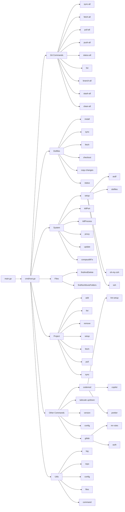

# eng CLI Architecture

This document describes the architecture and design of the `eng` CLI tool.

## Overview

The `eng` CLI is built using [Cobra](https://github.com/spf13/cobra) for command handling and [Viper](https://github.com/spf13/viper) for configuration management. It follows a modular design where each feature area is encapsulated in its own package under `cmd/`.

## Command Structure



## Directory Structure

```text
eng/
├── main.go                 # Entry point, delegates to cmd.Execute()
├── cmd/
│   ├── root.go            # Root command and global flags
│   ├── codemod/           # Codemod commands (lint-setup, prettier, copilot)
│   ├── config/            # Config management commands
│   ├── dotfiles/          # Dotfiles management commands
│   ├── files/             # File utility commands
│   ├── git/               # Git repository management commands
│   ├── gitlab/            # GitLab integration commands
│   ├── project/           # Project management commands
│   ├── system/            # System utility commands
│   ├── ts/                # Tailscale commands
│   └── version/           # Version command
├── internal/
│   └── utils/             # Internal utilities
│       ├── log/           # Colorized logging
│       ├── config/        # Config migration and management
│       ├── repo/          # Repository helpers
│       └── ...            # Other utilities
├── docs/                  # Documentation
└── scripts/               # Build and release scripts
```

## Key Design Principles

1. **Modular Commands**: Each command group is in its own package under `cmd/`, making it easy to add, modify, or remove features independently.

2. **Shared Utilities**: Common functionality (logging, config, file operations) is centralized in `internal/utils/` to avoid duplication.

3. **Configuration First**: All configurable values are managed through Viper, supporting both config files and environment variables.

4. **Consistent Logging**: All output goes through the custom logger (`internal/utils/log`) for consistent formatting and color support.

5. **Child Process Management**: External commands are spawned using `utils.StartChildProcess()` which handles signals and I/O properly.

## Configuration

Configuration is stored in `$HOME/.eng.yaml` and managed by Viper. The config supports automatic migration when keys are renamed (see `internal/utils/config/migration.go`).

Key configuration areas:

- `git.dev_path` — Development folder path for git commands
- `dotfiles.*` — Dotfiles repository settings
- `gitlab.*` — GitLab authentication and defaults
- `verbose` — Default verbose mode

## External Dependencies

The CLI integrates with several external tools:

- **glab** — GitLab CLI for MR operations
- **bw** — Bitwarden CLI for secret management
- **Homebrew** — Package management (macOS)
- **git-chglog** — Changelog generation
- **goreleaser** — Release automation

---

## Parable Bloom Subcommand (Deprecated)

> **Note**: The `parable-bloom` subcommand is deprecated and hidden. See the standalone `tools/level-builder` CLI for the canonical implementation.

## Directory Structure

```text
cmd/parable_bloom/
├── parable_bloom.go          # Main command definition
├── common/                   # Shared types and utilities
│   ├── models.go            # Core data structures (Level, Vine, Point, etc.)
│   ├── utils.go             # Common utility functions
│   ├── validators.go        # Validation logic
│   ├── file_io.go           # File I/O operations
│   ├── solver.go            # Level solving algorithms
│   ├── modules.go           # Module definitions and ranges
│   ├── presets.go           # Generation presets and profiles
│   └── validate_fast.go     # Fast validation routines
├── generate/                # Level generation subcommand
│   ├── level_generate.go    # Main generation logic
│   ├── generation.go        # Core generation algorithms
│   ├── tile_gen.go          # Tile-based generation
│   ├── cmd_param_sweep.go   # Parameter sweep functionality
│   └── *_test.go            # Unit and benchmark tests
├── validate/                # Level validation subcommand
│   └── level_validate.go    # Validation implementation
├── render/                  # Level rendering subcommand
│   └── level_render.go      # Rendering to various formats
└── repair/                  # Level repair subcommand
    └── level_repair.go      # Repair and fixing logic
```

## Package Organization

- **`parable_bloom`**: Root package containing the main command and subcommand registration
- **`common`**: Shared package containing types, utilities, and algorithms used across subcommands
- **`generate`**: Package for level generation functionality
- **`validate`**: Package for level validation
- **`render`**: Package for level rendering/output
- **`repair`**: Package for level repair and fixing

## Key Design Decisions

1. **Separated Packages**: Each subcommand is in its own package to maintain clear boundaries and enable focused testing
2. **Shared Common Package**: Common types and utilities are centralized to avoid duplication
3. **Import Prefixing**: Shared types are prefixed with `common.` for clarity
4. **Exported Functions**: Functions needed across packages are properly exported
5. **No Circular Imports**: Package dependencies flow from subcommands to common, not vice versa

## Testing

- Unit tests are co-located with their respective packages
- Benchmark tests ensure performance requirements are met
- Integration tests validate end-to-end functionality

## Dependencies

- Internal utils moved to `internal/utils/` for private utilities
- External dependencies minimized to maintain CLI portability
