# eng CLI Architecture

This document describes the architecture and design of the `eng` CLI tool.

## Overview

The `eng` CLI is built using [Cobra](https://github.com/spf13/cobra) for command handling and [Viper](https://github.com/spf13/viper) for configuration management. It follows a modular design where each feature area is encapsulated in its own package under `cmd/`, with shared services under `internal/`.

## Command Structure

```mermaid
graph LR
    A[main.go] --> B[cmd/root.go]

    B --> C1[git]
    C1 --> D1[sync-all]
    C1 --> D2[fetch-all]
    C1 --> D3[pull-all]
    C1 --> D4[push-all]
    C1 --> D5[status-all]
    C1 --> D6[list]
    C1 --> D7[branch-all]
    C1 --> D8[stash-all]
    C1 --> D9[clean-all]

    B --> C2[dotfiles]
    C2 --> E1[install]
    C2 --> E2[sync]
    C2 --> E3[fetch]
    C2 --> E4[checkout]
    C2 --> E5[copy-changes]
    C2 --> E6[status]
    C2 --> E7[secrets]

    B --> C3[setup]
    C3 --> F1[asdf]
    C3 --> F1b[dotfiles]
    C3 --> F1c[oh-my-zsh]
    C3 --> F1f[compauditFix]

    B --> C3a[gpg]
    C3a --> F7a[setup]
    C3a --> F7b[renew]
    C3a --> F7c[sync]

    B --> C3b[ssh]
    C3b --> F1d[setup]

    B --> C3c[kill]
    C3c --> F2[port]
    C3c --> F3[process]

    B --> C3d[proxy]
    B --> C3e[update]
    B --> C3f[clean]

    B --> C4[files]
    C4 --> I1[find-and-delete]
    C4 --> I2[find-non-movie-folders]
    C4 --> I3[shred]

    B --> C5[project]
    C5 --> J1[add]
    C5 --> J2[list]
    C5 --> J3[remove]
    C5 --> J4[setup]
    C5 --> J5[fetch]
    C5 --> J6[pull]
    C5 --> J7[sync]

    B --> C6[compose<br/>aliases: swarm, stack]
    C6 --> K1[up]
    C6 --> K2[down]
    C6 --> K3[pull]
    C6 --> K4[status]
    C6 --> K5[logs]
    C6 --> K6[clean]
    C6 --> K7[list]

    B --> C7[Other Commands]
    C7 --> G1[codemod]
    G1 --> G1a[lint-setup]
    G1 --> G1b[copilot]
    G1 --> G1c[prettier]
    C7 --> G2[tailscale<br/>alias: ts]
    C7 --> G3[version]
    C7 --> G4[config]
    C7 --> G5[gitlab]
    G5 --> G5a[mr-rules]
    G5 --> G5b[auth]
    C7 --> G6[asdf]
    C7 --> G7[immich]
    C7 --> G8[dashboard]
    C7 --> G9[doctor<br/>alias: doc]
    C7 --> G10[logs]

    B --> C8[Shared Services]
    C8 --> H1[ui + ui/theme]
    C8 --> H2[ui/dashboard]
    C8 --> H3[log]
    C8 --> H4[runlog]
    C8 --> H5[repo]
    C8 --> H6[config]
    C8 --> H7[containers]
    C8 --> H8[telemetry]
```



## Directory Structure

```text
eng/
├── main.go                  # Entry point, delegates to cmd.ExecuteContext(ctx)
├── cmd/
│   ├── root.go              # Root command, groups, global flags, initConfig, onboarding
│   ├── asdf/                # asdf version-manager helpers
│   ├── codemod/             # Codemod commands (lint-setup, prettier, copilot)
│   ├── compose/             # Docker Compose swarm management (aliases: swarm, stack)
│   ├── config/              # Config management commands
│   ├── dashboard.go         # Dashboard + hidden select-editor commands
│   ├── doctor/              # Workstation diagnostics (alias: doc)
│   ├── dotfiles/            # Dotfiles management + secrets commands
│   ├── files/               # File utilities (find-and-delete, shred, …)
│   ├── git/                 # Git repository management commands
│   ├── gitlab/              # GitLab integration commands
│   ├── immich/              # Immich helpers
│   ├── logs/                # Session-log viewer (list, show, clean)
│   ├── project/             # Project management commands
│   ├── proxy/               # Proxy profiles (status, use, add, export, …)
│   ├── setup/               # Workstation setup orchestrator (asdf, dotfiles, oh-my-zsh)
│   ├── ssh/                 # SSH key setup for GitHub (setup)
│   ├── gpg/                 # GPG key management (setup, renew, sync)
│   ├── kill/                # Process termination (port, process)
│   ├── update/              # System update + IDE installer
│   ├── clean/               # Host storage cleanup (wraps internal/cleanup)
│   ├── ts/                  # Tailscale commands (alias: ts)
│   └── version/             # Version command
├── internal/
│   ├── asdf/                # asdf helpers
│   ├── bitwarden/           # Bitwarden CLI helpers
│   ├── cleanup/             # Cleanup/report engine
│   ├── cmdutil/             # Shared cobra helpers (verbosity, contexts)
│   ├── config/              # Config access, migration, onboarding, interactive editor
│   ├── containers/          # Compose stack discovery and management
│   ├── dotfiles/            # Bare-repo dotfiles operations
│   ├── execx/               # Process execution entry points (mockable Runner)
│   ├── fs/                  # Filesystem helpers (incl. secure shred)
│   ├── immich/              # Immich client
│   ├── log/                 # Unified logging (terminal + session-file tee)
│   ├── paths/               # Home-dir resolution + path expansion (single source)
│   ├── project/             # Project fetch/pull/sync engine
│   ├── repo/                # Git repository helpers
│   ├── runlog/              # Session log files (create, list, resolve, prune)
│   ├── secrets/             # Dotfiles secrets (Bitwarden Secrets Manager)
│   ├── sysinfo/             # OS/distro detection
│   ├── telemetry/           # Async OpenPanel telemetry client
│   ├── version/             # Build metadata leaf (Version/Commit/Date via ldflags)
│   └── ui/                  # Lipgloss theme, prompts, spinners, tables, dashboard TUI
├── docs/                    # Documentation (Diátaxis layout, see docs/README.md)
└── tools/gendocs/           # CLI reference generator (`task docs`)
```

## Key Design Principles

1. **Modular Commands**: Each command group is in its own package under `cmd/`, making it easy to add, modify, or remove features independently. `eng system` was split into top-level `eng setup|gpg|ssh|proxy|update|clean|kill` so each domain owns its flags, tests, and docs. When two paths need the same tree, a factory in `internal/` builds it (`internal/immich.NewCommand`) so each registration gets independent flag state instead of sharing copies.

2. **Shared Services**: Common functionality lives in `internal/` packages (`log`, `config`, `repo`, `ui`, `runlog`, …) to avoid duplication.

3. **Configuration First**: All configurable values are managed through Viper (`$HOME/.eng.yaml`), supporting config files and environment variables, with automatic key migration.

4. **Unified Output**: All terminal output flows through the `log` package and `ui/theme` writers (`log.Out`/`log.Err`), so tests, pipes, and shell completion can redirect or capture it. Machine-consumed output (JSON, `eval`-able exports) stays byte-clean on stdout.

5. **Progressive Disclosure**: Verbose commands write full detail to session log files (`internal/runlog`, viewable via `eng logs`) while the terminal shows only clean summaries.

6. **Actionable Errors**: Failures render styled error boxes with next-step suggestions (`theme.NewActionableError`), and `eng doctor` exits non-zero so CI can gate on workstation health.

## Dependency Rules

Layering keeps the codebase navigable. Enforced by inspection (and CI grep in the future):

1. **`cmd/` composes `internal/`** — commands wire services together; they never contain reusable logic that another command needs.
2. **Never `internal/` → `cmd/`** — shared services stay importable without pulling in the CLI. Build metadata lives in the leaf package `internal/version` (stamped via ldflags) so `internal/telemetry` and `cmd/doctor` read it without touching `cmd/version`.
3. **No sibling `cmd/` imports** (except parent→child aggregation: `root`, and `gitlab` → `gitlab/auth`) — shared command trees are built by factories in `internal/`. Cross-domain setup steps are injected as hook variables with loud unwired defaults (see `cmd/setup/common.go: GPGSetup/IDEUpdate`, wired in `cmd/root.go`), never imported.
4. **`ui` never imports domain** — presentation renders plain structs/DTOs; `config`, `repo`, and `containers` types are mapped at the `cmd/` boundary. Interactive steps needed by workflows are injected as hook variables with loud unwired defaults (see `cmd/setup/dotfiles_hooks.go`, `cmd/ssh/dotfiles_hooks.go`, `cmd/clean/cleanup_hooks.go`, `cmd/config/prompts.go`), never imported.
5. **Output goes through `log`/`theme` writers** — no direct `os.Stdout` in display or library code (interactive children are the exception), so tests, pipes, and `__complete` stay clean.

## Configuration

Configuration is stored in `$HOME/.eng.yaml` and managed by Viper. The config supports automatic migration when keys are renamed (see `internal/config/migration.go`). On true first run, an interactive onboarding wizard offers to configure essentials (see `internal/config/onboarding.go`).

Key configuration areas:

- `git.dev_path` — Development folder path for git commands
- `dotfiles.*` — Dotfiles repository settings
- `gitlab.*` — GitLab authentication and defaults
- `containers.path` — Compose stacks root
- `proxies` — Named proxy configurations
- `projects` — Project collections
- `telemetry.*` — Telemetry opt-out and endpoint
- `verbose` — Default verbose mode

## External Dependencies

The CLI integrates with several external tools:

- **glab** — GitLab CLI for MR operations
- **bw** / **bws** — Bitwarden CLI / Secrets Manager for secret management
- **Homebrew** — Package management (macOS)
- **docker** — Container runtime for compose swarms and Immich
- **goreleaser** — Release automation

---

## Testing

For details on the testing methodology, run commands, and mocking strategies, see the [Testing Guide](../how-to/test.md).
