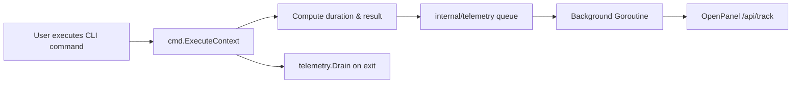

# Telemetry and Analytics Architecture

This document describes the design, privacy protections, event schema, and OpenPanel dashboard configuration for the `eng` CLI telemetry subsystem.

---

## Overview

The `eng` CLI incorporates an asynchronous, non-blocking telemetry system designed to collect usage data, execution performance, reliability insights, and environment metadata without impacting user command latency or exposing sensitive data.

Telemetry data is ingested by a self-hosted or cloud-hosted **OpenPanel** instance.



---

## Privacy & Data Sanitization

The telemetry client is engineered with a strict **privacy-first** approach:

1. **Zero Secret / Token Capture**:
   - Only command and flag names are tracked (e.g. `["--verbose"]`). Flag values and command positional arguments are strictly omitted to prevent leaking secrets, credentials, file paths, or PII.
2. **Anonymous Identification**:
   - Users/machines are tracked using a randomly generated RFC 4122 v4 UUID (`profile_id`) stored locally in `~/.eng.yaml`. No usernames, home directory paths, or hardware serial numbers are captured.
3. **Global Opt-Out Standards**:
   - Respects the Console Do Not Track standard (`DO_NOT_TRACK=1`).
   - Respects environment flags (`ENG_TELEMETRY_DISABLED=1`).
   - Can be toggled on/off via the CLI: `eng config telemetry disable`.
4. **Non-Blocking & Fail-Safe**:
   - Events are buffered in memory and sent via a background worker goroutine.
   - Flush timeout is capped at 400ms on CLI exit.
   - Network errors, timeouts, or offline status are silently swallowed to ensure the CLI never fails due to telemetry.

---

## Event Schema & Tracked Properties

### Events Sent by `eng`

| Event Name                    | Trigger                                                            |
| :---------------------------- | :----------------------------------------------------------------- |
| `cli_command_executed`        | Dispatched upon completion of any CLI command                      |
| `doctor_diagnostics_run`      | Dispatched when `eng doctor` runs                                  |
| `telemetry_connection_tested` | Dispatched when testing connection via `eng config telemetry test` |

### `cli_command_executed` Payload Properties

| Property         | Type    | Example Values                             | Description                                            |
| :--------------- | :------ | :----------------------------------------- | :----------------------------------------------------- |
| `command`        | String  | `git sync`, `doctor`, `system update`      | Full command path executed                             |
| `root_command`   | String  | `git`, `system`, `dotfiles`                | Top-level command group                                |
| `subcommand`     | String  | `sync`, `update`, `auth`                   | Nested subcommand                                      |
| `duration_ms`    | Number  | `45`, `1240`                               | Execution latency in milliseconds                      |
| `success`        | Boolean | `true`, `false`                            | Whether command completed successfully                 |
| `exit_code`      | Number  | `0`, `1`                                   | Command process exit code                              |
| `error_category` | String  | `none`, `usage_error`, `permission_denied` | Categorized error classification                       |
| `flags`          | Array   | `["--verbose"]`                            | Sanitized list of flag names passed                    |
| `flags_count`    | Number  | `1`                                        | Count of flags used                                    |
| `args_count`     | Number  | `2`                                        | Count of positional arguments                          |
| `cli_version`    | String  | `1.47.0`, `dev`                            | Installed CLI version                                  |
| `build_commit`   | String  | `a1b2c3d`                                  | Git commit hash at compile-time                        |
| `go_version`     | String  | `go1.24.0`                                 | Go runtime version                                     |
| `os`             | String  | `darwin`, `linux`, `windows`               | Client operating system                                |
| `arch`           | String  | `arm64`, `amd64`                           | Client CPU architecture                                |
| `is_ci`          | Boolean | `true`, `false`                            | Whether executed in CI runner (GitHub Actions, etc.)   |
| `is_interactive` | Boolean | `true`, `false`                            | Whether standard output is connected to a TTY terminal |
| `shell`          | String  | `zsh`, `bash`, `fish`                      | User's active shell                                    |

---

## OpenPanel Dashboard Configuration

The default OpenPanel **Overview** screen is designed for web traffic (pageviews, bounce rate, SEO). For CLI analytics, use **Dashboards**, **Insights**, **Events**, and **Profiles**.

### Recommended Dashboard: "ENG CLI Analytics"

Create a new dashboard in OpenPanel (**Dashboards** > **New Dashboard**) and add the following 8 report widgets:

#### 1. Top Commands Executed (Bar Chart / Table)

- **Goal**: Identify most popular commands and workflows.
- **Event**: `cli_command_executed`
- **Metric**: Total Events
- **Group by**: `command` (or `root_command`)
- **Time Range**: Last 30 Days

#### 2. Daily Active Users & Machines (Time Series Line Chart)

- **Goal**: Track daily active machines (DAU) and adoption trends.
- **Event**: `cli_command_executed`
- **Metric**: Unique Profiles (`profileId`)
- **Interval**: Daily (`Day`)

#### 3. Total Executions & Reliability Rate (KPI Stat Cards)

- **Goal**: Monitor high-level command volume and overall success percentage.
- **Event**: `cli_command_executed`
- **Metrics**: Total Event Count & `% success == true`

#### 4. Error Category Breakdown (Donut Chart)

- **Goal**: Spot trends in errors across the user base.
- **Event**: `cli_command_executed`
- **Filter**: `success` is `false` (or `error_category != none`)
- **Group by**: `error_category`

#### 5. CLI Version Distribution (Donut Chart)

- **Goal**: Monitor version adoption and verify users are upgrading to the latest release.
- **Event**: `cli_command_executed`
- **Group by**: `cli_version`

#### 6. Operating System & Architecture (Pie / Donut Chart)

- **Goal**: Understand hardware distribution (Apple Silicon `darwin/arm64` vs Intel `darwin/amd64` vs Linux).
- **Event**: `cli_command_executed`
- **Group by**: `os` and `arch`

#### 7. Command Execution Latency (Bar Chart / Ranking)

- **Goal**: Identify slow commands and performance bottlenecks.
- **Event**: `cli_command_executed`
- **Metric**: Average of `duration_ms` (or P95 latency)
- **Group by**: `command`
- **Sort**: Descending by duration

#### 8. Interactive vs CI Usage (Donut Chart)

- **Goal**: Measure whether users run commands in interactive terminals vs automated CI runners.
- **Event**: `cli_command_executed`
- **Group by**: `is_ci`

---

## CLI Management Commands

Users can inspect and manage telemetry preferences directly from the CLI:

```sh
# View current telemetry status and anonymous profile ID
eng config telemetry status

# Test connection to the OpenPanel endpoint
eng config telemetry test

# Enable telemetry
eng config telemetry enable

# Disable telemetry (opt-out)
eng config telemetry disable

# Verify system & telemetry health
eng doctor
```

---

## Build & Release Credentials

Credentials are never committed in plain text source code. They are injected at compile time by GoReleaser in GitHub Actions via `-ldflags`:

- `DefaultAPIURL`: `https://openpanel.gventureshq.com/api`
- `DefaultClientID`: Injected via `OPENPANEL_CLIENT_ID` repository secret
- `DefaultClientSecret`: Injected via `OPENPANEL_CLIENT_SECRET` repository secret
